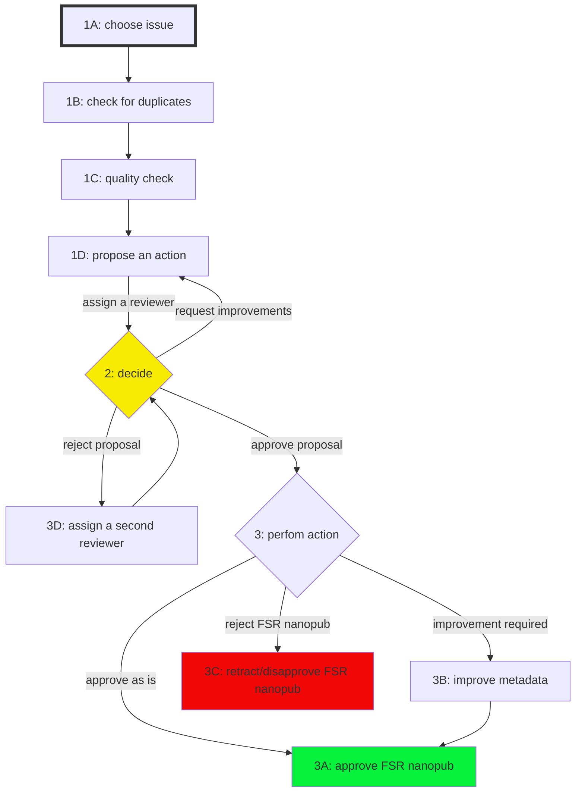
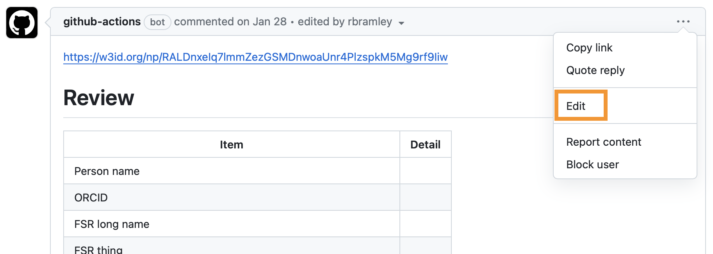
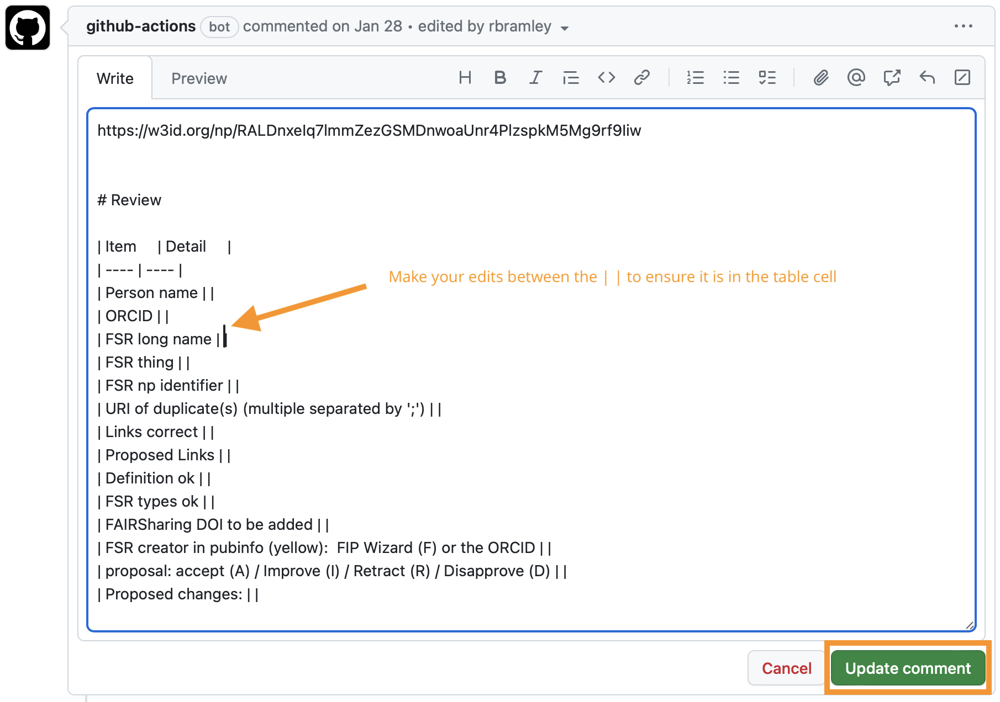
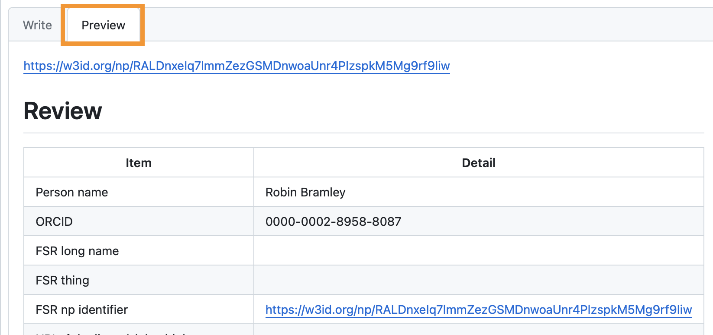
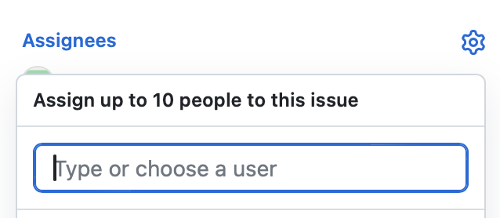
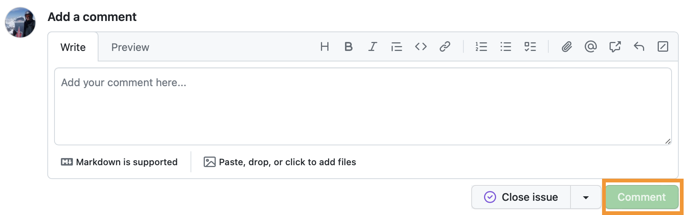
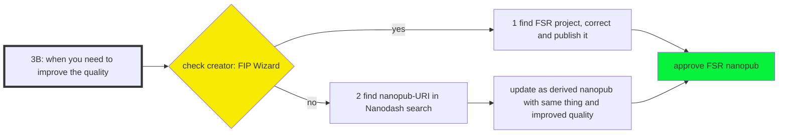
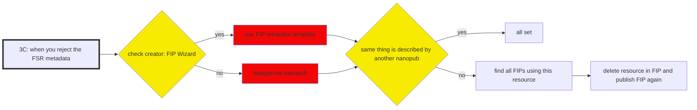
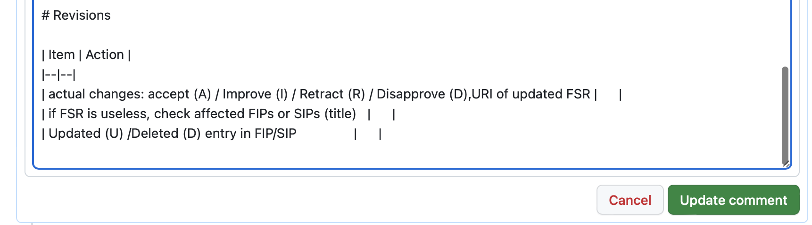
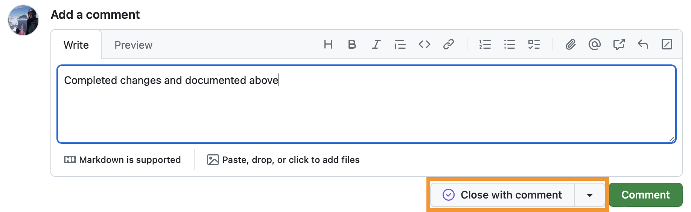

# **GFF Curation workflow for FAIR Supporting Resources (FSR) metadata**

## **Introduction**

Please be aware that only trained people according to the [Three-Point FAIRification Framework](https://www.gofair.foundation/3pff) can participate in this process. Please check this [table](https://docs.google.com/spreadsheets/d/1hLEimbWKdlyouIF4ZoerGG6mia58c98PsVQ8hIT4hqw/edit#gid=0) if your name is already registered. 

An FSR curation process requires a minimum of two trained people to curate new FSR nanopublications (nanopubs). The first person acts as curator and checks if there exists more than one nanopub for the same FSR. The curator then analyses the quality of the most comprehensive nanopub, which is usually the most recent nanopub, and proposes to retract the other duplicates. The curator will then propose if the FSR nanopub should be accepted as is, whether it requires changes or should be retracted. The curator assigns a reviewer (who is the second person n the process), preferably one with expertise related to the FSR type, to check the actions proposed for the FSR nanopub. The reviewer can accept it, request changes, or reject it. If the reviewer’s answer is positive, the curator can follow the suggestions proposed to finally approve it. 

The whole curation process is supposed to be described in GitHub issues in this GitHub repository. To collaborate, each contributor needs a GitHub account and the administrator has to add these accounts to the curation team to grant write access to this repository.

## **Overall curation procedure**

### **1 Curator actions**

#### 1A. Choose an issue 
from GitHub: https://github.com/gofair-foundation/fsr_curation/issues - these issues are created by a [GitHub action](#appendix-b-refreshing-the-github-issues-list) that looks at uncurated FSRs in Nanodash.  
   These can be filtered by label (FSR type) from https://github.com/gofair-foundation/fsr_curation/labels  
   Assign it to you (so that everybody can see that you are working on it)

#### 1B. Check for duplicates

1. Use the API: [check duplicates](https://peta-pico.github.io/tapas/tapas.html?api=peta-pico/dsw-nanopub-api&op=/find_gofair_qualified_things_x) by searching with the most common name (and similar names) of the FSR if there exists more than one nanopub.
2. The goal is to keep only the most informative nanopub, bear in mind that you should also check for the most frequently used resource in the FIPs/SIPs. Check their utilisation using the FSR thing URI within the [FSR in FIP/SIP API](https://github.com/peta-pico/dsw-nanopub-api/blob/main/tables/new_matrix_reduced.csv). However the most frequently used nanopub may need to be improved (as per the process in [F3B](#f-3b-proposal-accept-with-improvements) below).
3. Duplicates will need to be retracted/disapproved. Once retracted, all related GitHub issues will be automatically closed. Therefore it is essential that the same person(s) work on all duplicates of one resource.
4. Start with the GitHub issue of the nanopub that you want to keep.  

#### 1C. Quality check 
the existing nanopub that provides the metadata of a FSR and document it:
   Edit the issue description. Ensure that you do not edit/remove the nanopub URI in the first line of the issue. 
   

   Complete the **"Document quality check"** table by editing it between the pipe (|) delimiters, then click on 'Update comment' when you are done.
  

   You can use the preview function to check that your additions are in the table correctly:
   
   

1. Add your name and ORCID

2. Add the FSR long name and the FSR thing URI (= subject URI, the identifier of the resource itself)

3. Add all URIs of duplicate(s) if they exist using the *Check Duplicates API*
  
4. Check if the web links provided are working (add Y or N)
   
5. Suggest replacement with new (persistent) web links if considered useful
   
6. Check if the description is informative enough or if it needs to be corrected/improved (add Y or N)

7. Check if the allocated **FSR types** are all correct (add Y or N) - If you think that a change is needed, this will have **consequence for its use in the FIPs**!
  
8. Check if the resource is described in FAIRsharing and if a DOI exists. If so, then check if the nanopub already refers to it. In case the FAIRsharing does not refer to it, add it in the table. Be aware that FAIRsharing has not all types included and thus not all resources will have a reference in FAIRsharing.
  
9. If the FSR was created in the FIP wizard add an F or if it was created in the SIP wizard add an S to the table. Otherwise, if it was created in Nanodash, add the creator's ORCID. In addition, check if the `prov:wasDerivedFrom` in the pubinfo section of the nanopub resolves to the correct FSR project in the wizard (see https://github.com/fip-wizard/fip-wizard/issues/1)

Finally,

#### 1D. Make a proposal:

1. accept as is (type “A” in the space provided)
2. improve (type “I” in the space provided)
3. reject (type "R" for retract in case it was created in the FIP Wizard, or "D" for disapprove if it was created in Nanodash)
4. suggest changes if you think it should be improved.
   
and assign a reviewer to review the proposal based on their expertise. If the reviewer doesn’t respond within 24 hours, check for another reviewer.

### 2 Reviewer actions 

You will have received an email alert for the assigned issue and can review the proposed changes in the issue.

Then you decide either to:

2A. approve the proposal (type “A” in the space provided)
2B. accept the proposal with some required improvements (type “I” in the space provided)
2C. reject the proposal (type “R” in the space provided)

To document your decision you are asked to:
**Issues 639 onwards** (new template):  
   a. Add your name and ORCID to the **"Review"** table of the GitHub issue  
   b. Capture your decision on whether you **Approve**, or **Reject** or **Improve** (with comments)  
**Issues up to 638**:  
   a. Capture your decision on whether you **Approve**, or **Request changes** (or **Comment** if you need further information or have a different opinion on the course of action) as a comment on the issue: 
   
   

Reassign the issue back to the curator.

### 3 Final Curator actions

You perform the actions based on the reviewer decision. 
- if the proposal is accepted with changes: negotiate with the reviewer and makes adjustments until both of you are satisfied and the review accepts the proposal;
- if the reviewer accepts the proposal: proceed with your [proposed action](#1d-make-a-proposal):

3A. proposal - accept as is: approve the FSR nanopub with the [approval nanopub template](https://nanodash.petapico.org/publish?34&template=https://w3id.org/np/RAi7_UxEF3TTPBp7lmWOVvKR-jUmZgDfY_ZIe57dqbOnQ&template-version=latest)  
3B. proposal - accept with improvements: proceed with the improvement (see below)  
3C. proposal - reject: disapprove/retract the nanopub (see below).  

3D. If the reviewer rejects your proposal, assign the issue to a second reviewer. You should follow the decision that has at least two supporters.

#### 3B Proposal accept with improvements:

Before changing the metadata, it is recommended that you send an email to the creator of the FSR nanopub (the email address can be found in the FIP wizard if you are an admin) to inform them of your intended change. 

Here a proposal for the email text:
*I am an administrator of the FIP Wizard, trained by GO FAIR Foundation, and I help to improve the quality of the metadata of the FIP/FER resources. Following your entry and based on the peer-review process documented in the github issue number X, I want to make/made the following improvement:...,*  

If you don't get a reply within a reasonable time (max. two days), post a comment directly in the appropriate place in the FSR project in the FIP Wizard. 

1. If the creator is the FIP Wizard 
   1. find the project, improve the metadata and publish a new nanopub
   2. approve the FSR nanopub with the [approval nanopub template](https://nanodash.petapico.org/publish?34&template=https://w3id.org/np/RAi7_UxEF3TTPBp7lmWOVvKR-jUmZgDfY_ZIe57dqbOnQ&template-version=latest)

2. If the creator is documented via an ORCID (then you work with Nanodash)
   1. search for the nanopub-URI in the search bar of Nanodash
   2. update as derived nanopub, copy the URI of the subject in the original FSR nanopub into the short name, improve metadata, and publish it
   3. in case you want to use a new template use this procedure: https://nanodash.knowledgepixels.com/publish?template=*newTemplateURI*&supersede=*oldNanopubURI* and copy the Thing URI of the original FSR nanopub into the short name, improve metadata, add the old nanopub URI (not the thing URI!) in the Pub Info by adding a new element "derived" in the statement: *This nanopublication was derived from nanopub URI* and publish it
   4. in case you need to **make a change regarding the types that apply** please follow these steps:
      - Check if and in which questions the **FSR** is used **in FIPs** by using this API: [**find FSRs in FIP**](https://github.com/peta-pico/dsw-nanopub-api/blob/main/tables/new_matrix_reduced.csv)
      - Adjust the choice in the FIP (and leave a comment to justify the adjustment)
      - Re-publish the FIP
   5. disapprove the old nanopub that has been superseeded with the nanopub with improved metadata
   6. approve the FSR nanopub with the [approval nanopub template](https://nanodash.petapico.org/publish?34&template=https://w3id.org/np/RAi7_UxEF3TTPBp7lmWOVvKR-jUmZgDfY_ZIe57dqbOnQ&template-version=latest)

#### Adding a reference to FAIRsharing records
If a FAIRsharing DOI needs to be added, then in the FIP Wizard this can be added as a Resource URI to II.9 "Related resources to which this resource can be mapped to and which are used to derive its description". Similarly, in Nanodash this URI would be introduced as `exactMatch` in the last assertion statement and in the provenance of the nanopub use the statement "attributed to myself/others and (partly) derived from an existing entity" and add the DOI of the FAIRsharing record.

#### 3C When the FSR nanopub should be retracted

1. Check who is the creator. 
   1. If the creator is the FIP Wizard, then create a project with the nanopub Retraction template (under Custom templates) and follow the instructions to retract an FSR
   2. If the creator is documented with an ORCID (then you work with Nanodash) use [this nanopub template](https://nanodash.knowledgepixels.com/publish?14&template=http://purl.org/np/RAgXKeS8wLficVpkOIbU2aF5O5Zuy7KZ_3gNUr7D5BS8c) to disapprove the nanopub (keep in mind only ORCIDs of qualified facilitators will have an impact on the FIP Wizard filters). **Ensure that you use the** `http://purl.org/np/` (or `http://w3id.org/np/`) **URI and not the** `https://np.knowledgepixels.com/` **URI.** 

2. Check if the same thing is described by another nanopub.
   1. If the same thing has been updated by a newer FSR nanopub (Option A), all is done
   2. If the same thing is not updated by another FSR nanopub but the entry is rejected: 
      1. Check if the FSR is used in FIPs by using this API: [**find FSRs in FIP**](https://github.com/peta-pico/dsw-nanopub-api/blob/main/tables/new_matrix_reduced.csv)
      2. Delete choice in FIP
      3. Re-publish the FIP

Finally 
Edit the issue description to add your annotations in the bottom table between the pipe (|) delimiters. 

   
   
For all FSRs that should be approved, make sure the approval nanopub is created before you close the issue. 

   

------

# **Appendix A: Refreshing the GitHub issues list**

The GitHub issues list is populated from Nanodash by a custom GitHub [action](https://github.com/gofair-foundation/fsr_curation/actions/workflows/issue.yml). 
This will create issues for new not yet curated FSRs and close any open issues for FSRs that are no longer uncurated.

The action is currently scheduled to run at 04:30 UTC on Sundays; to trigger it manually (e.g. after a FIP workshop): 

1. Go to the ‘Actions’ tab (red box)
2. Click on ‘issue_creation’ (blue box) 
3. Click on ‘Run workflow’ (green box)
4. Click on the ‘Run workflow’ green button (orange box)

